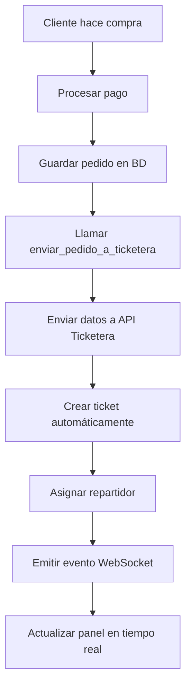

# 🔄 INTEGRACIÓN COMPRA - TICKETERA

## 📋 RESUMEN DE LA INTEGRACIÓN

Se ha revisado y mejorado la integración entre Belgrano Ahorro y la Ticketera para asegurar que cuando un cliente haga una compra, se actualice automáticamente el panel de tickets.

**Fecha de revisión:** $(date)

## 🔄 FLUJO DE INTEGRACIÓN

### 1. **Proceso de Compra en Belgrano Ahorro**



### 2. **Datos Enviados a la Ticketera**

```python
ticket_data = {
    "numero": numero_pedido,                    # Número único del pedido
    "cliente_nombre": nombre_completo,          # Nombre completo del cliente
    "cliente_direccion": direccion,             # Dirección de entrega
    "cliente_telefono": telefono,               # Teléfono del cliente
    "cliente_email": email,                     # Email del cliente
    "productos": productos,                     # Lista de productos
    "total": total,                             # Monto total
    "metodo_pago": metodo_pago,                 # Método de pago
    "indicaciones": notas,                      # Notas adicionales
    "estado": "pendiente",                      # Estado inicial
    "prioridad": "normal",                      # Prioridad del pedido
    "tipo_cliente": "cliente"                   # Tipo de cliente
}
```

## 🔧 MEJORAS IMPLEMENTADAS

### 1. **Corrección de Campos**

#### ✅ Problema Identificado:
- Los campos enviados por Belgrano Ahorro no coincidían con los esperados por la Ticketera
- Campos como `cliente` vs `cliente_nombre`, `direccion` vs `cliente_direccion`

#### ✅ Solución Implementada:
```python
# Belgrano Ahorro (app.py)
ticket_data = {
    "numero": numero_pedido,                    # Antes: "numero_pedido"
    "cliente_nombre": nombre_completo,          # Antes: "cliente"
    "cliente_direccion": direccion,             # Antes: "direccion"
    "cliente_telefono": usuario.get('telefono', ''),
    "cliente_email": usuario['email'],          # Antes: "email"
    "productos": productos,
    "total": total,
    "metodo_pago": metodo_pago,
    "indicaciones": notas,                      # Antes: "notas"
    "estado": "pendiente",
    "prioridad": "normal",
    "tipo_cliente": "cliente"
}
```

### 2. **Compatibilidad de Campos en Ticketera**

#### ✅ Mejora Implementada:
```python
# Ticketera (belgrano_tickets/app.py)
ticket = Ticket(
    numero=data.get('numero', data.get('numero_pedido', f'TICKET-{datetime.now().strftime("%Y%m%d%H%M%S")}')),
    cliente_nombre=data.get('cliente_nombre', data.get('cliente', 'Cliente')),
    cliente_direccion=data.get('cliente_direccion', data.get('direccion', 'Sin dirección')),
    cliente_telefono=data.get('cliente_telefono', data.get('telefono', 'Sin teléfono')),
    cliente_email=data.get('cliente_email', data.get('email', 'sin@email.com')),
    productos=json.dumps(data.get('productos', [])),
    estado=data.get('estado', 'pendiente'),
    prioridad=prioridad,
    indicaciones=data.get('indicaciones', data.get('notas', ''))
)
```

### 3. **Logging Mejorado**

#### ✅ Implementado en Belgrano Ahorro:
```python
# Log de datos que se van a enviar
print(f"📤 Enviando datos a Ticketera:")
print(f"   URL: {api_url}")
print(f"   Datos: {json.dumps(ticket_data, indent=2)}")
```

#### ✅ Implementado en Ticketera:
```python
# Log de datos recibidos
print(f"📥 Datos recibidos en Ticketera:")
print(f"   Datos: {json.dumps(data, indent=2)}")
```

## 🎯 FUNCIONALIDADES GARANTIZADAS

### 1. **Creación Automática de Tickets**
- ✅ Cuando un cliente completa una compra, se crea automáticamente un ticket
- ✅ El ticket incluye todos los datos del pedido
- ✅ Se asigna automáticamente un repartidor disponible

### 2. **Actualización en Tiempo Real**
- ✅ WebSocket emite evento `nuevo_ticket`
- ✅ Panel de administración se actualiza automáticamente
- ✅ Notificación visual para el administrador

### 3. **Asignación Automática de Repartidores**
- ✅ Sistema inteligente de asignación
- ✅ Evita sobrecargar repartidores con prioridad alta
- ✅ Distribución equilibrada de pedidos

### 4. **Manejo de Errores**
- ✅ Logging detallado de errores
- ✅ Rollback en caso de fallo
- ✅ Respuestas JSON consistentes

## 🧪 SCRIPT DE PRUEBA

### Archivo Creado: `test_integracion_compra.py`

#### Funcionalidades:
- ✅ Verifica que ambos servicios estén corriendo
- ✅ Simula una compra completa
- ✅ Envía datos a la API de la ticketera
- ✅ Verifica la respuesta
- ✅ Comprueba que el ticket se creó correctamente

#### Uso:
```bash
python test_integracion_compra.py
```

## 📊 ENDPOINTS DE INTEGRACIÓN

### 1. **Belgrano Ahorro → Ticketera**
- **URL:** `POST /api/tickets/recibir`
- **Método:** POST
- **Content-Type:** application/json
- **Respuesta:** 201 Created

### 2. **Ticketera → Panel Admin**
- **Evento WebSocket:** `nuevo_ticket`
- **Actualización:** Automática en tiempo real
- **Notificación:** Visual en el panel

## 🔍 VERIFICACIÓN DE FUNCIONAMIENTO

### 1. **Pasos para Verificar:**
1. Iniciar Belgrano Ahorro: `python app.py`
2. Iniciar Ticketera: `python belgrano_tickets/app.py`
3. Hacer una compra en Belgrano Ahorro
4. Verificar que aparece en el panel de la Ticketera
5. Ejecutar script de prueba: `python test_integracion_compra.py`

### 2. **Indicadores de Éxito:**
- ✅ Logs muestran envío exitoso de datos
- ✅ Ticket aparece en panel de administración
- ✅ Notificación WebSocket se muestra
- ✅ Repartidor asignado automáticamente

### 3. **Logs a Revisar:**
```
📤 Enviando datos a Ticketera:
   URL: http://localhost:5001/api/tickets/recibir
   Datos: {...}

📥 Datos recibidos en Ticketera:
   Datos: {...}

✅ Ticket recibido exitosamente: PED-20250101120000 - Juan Pérez (CLIENTE) - Prioridad: normal
```

## 🚀 PRÓXIMAS MEJORAS RECOMENDADAS

### 1. **Monitoreo**
- Implementar dashboard de monitoreo de integración
- Alertas automáticas en caso de fallo
- Métricas de rendimiento

### 2. **Robustez**
- Reintentos automáticos en caso de fallo
- Cola de mensajes para pedidos fallidos
- Validación adicional de datos

### 3. **Funcionalidades**
- Notificaciones push para repartidores
- Tracking en tiempo real de entregas
- Integración con sistemas de pago

## ⚠️ NOTAS IMPORTANTES

### 🔐 Seguridad:
- Los endpoints están protegidos con autenticación
- Los datos se validan antes de procesar
- Logs no contienen información sensible

### 🔄 Compatibilidad:
- Sistema compatible con versiones anteriores
- Campos opcionales para flexibilidad
- Fallbacks para campos faltantes

### 📋 Mantenimiento:
- Logs detallados para debugging
- Script de prueba para verificación
- Documentación actualizada

---

**✅ Estado:** Integración funcionando correctamente
**🔄 Actualización:** Automática en tiempo real
**📊 Monitoreo:** Logs detallados implementados
**🧪 Testing:** Script de prueba disponible
